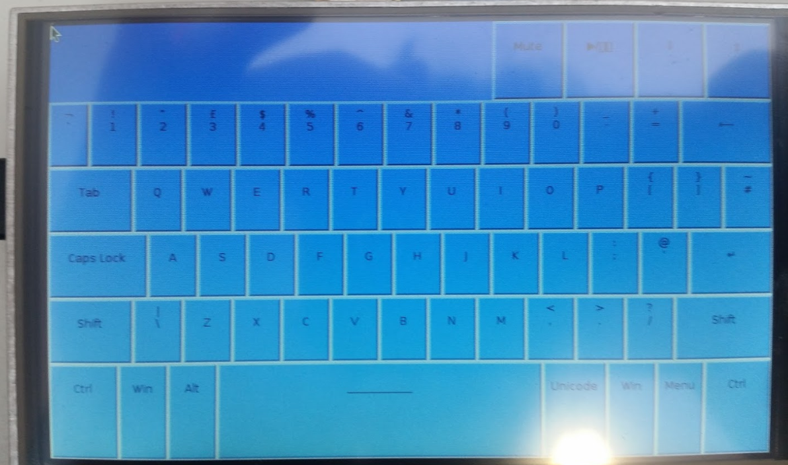

# Pi_keyboard

## Explanation

I started this project as part of my A-level computer science course. The purpose of this project was to create a virtual keyboard that would run on a raspberry pi zero (*see end for photo*). The project was unrealistically ambitious as is typical of early projects and was only ever partially completed. I have slightly cleaned up the project and am releasing  it... *I don't really know why*

The project was written in `python` and uses `tkinter` to create the UI

## Using the application

to run the application, just run `Keyboard.py`

The keyboard was meant to be able to send characters to other devices, but this functionality was never implemented. For this reason the `send()` function is used as a placeholder for sending a keypress to another device, it currently just prints the character to console

### Profiles

The project was meant to allow the user to create and store profiles and this functionality is implemented... *badly*

The profiles are stored in text files, named `Profile1.txt`, `Profile2.txt` and so on. each profile contains:

* The keyboard layout (`qwerty`, `colemak` or `dvorak`)
* The background colour, as a hexcode
* The foreground colour, as a hexcode
* The active background colour, as a hexcode
* The active foreground colour, as a hexcode
* The character that will be output when the `unicode` character is pressed

The currently selected profile, followed by a list of all profiles, including the currently selected one are all stored in `Profiles.txt`

### Making it fullscreen - *not recommended*

The project was initially intended to run on the touchscreen of a specific raspberry pi, the UI is therefore designed for a window of a specific size, when the project was initially created, the keyboard ran in fullscreen but when running the program on a different machine it best to run it as a window. I have therefore changed the interface to run in a window of the correct size, if you really want to run it in fullscreen, you can change the global variable `fullScreen` to `True` **I do not recommend this**

### Documents from original project

When making the project I also had to make a write up. I have included said write up as `Project-Write-Up.pdf` incase it is of use. I have also included a photo I took of the project when it was running on the Pi Zero, as `Demo.png`, it is shown below:

